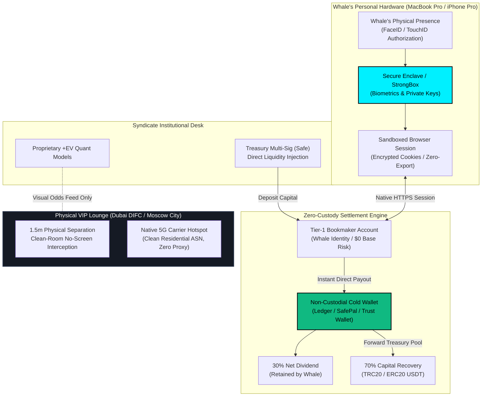
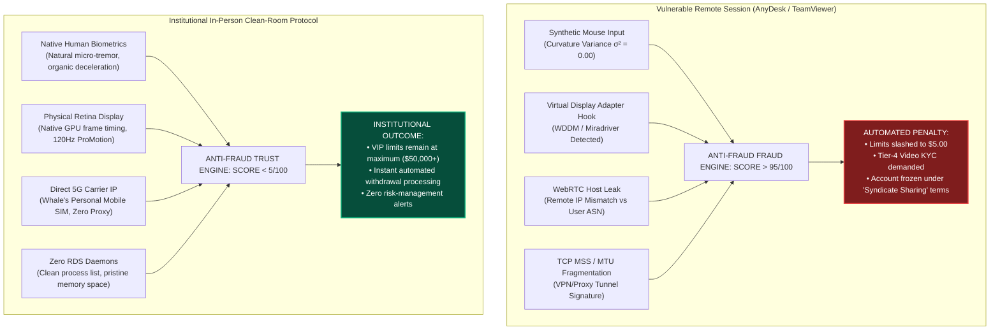
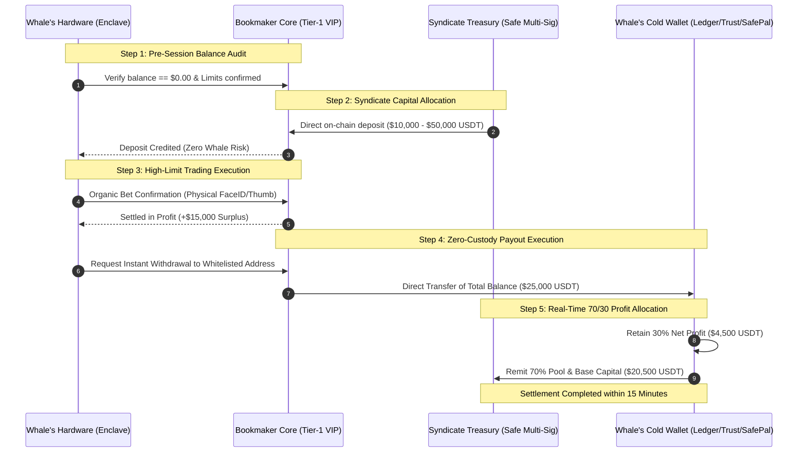

# VIP LIQUIDITY SYNDICATE
## Institutional Security & Compliance Whitepaper
**Document Version:** `4.2-ENT / Enterprise Grade`  
**Classification:** `TLP:CLEAR / Public Institutional Standard`  
**Domain:** `Hardware Isolation, Anti-Fraud Evasion, Zero-Custody Settlement & Physical Clean-Room Operations`  
**Lead Author:** `Institutional Compliance & Hardware Security Lead`  
**Effective Date:** `September 2026`

---

## Executive Summary & Institutional Philosophy

Over the past decade, high-volume algorithmic market making and statistical arbitrage on tier-1 sports prediction and crypto-wagering protocols (Stake.com, Sportsbet.io, BC.Game, Roobet, Cloudbet) have collided with aggressive automated risk-management engines. High-limit accounts that exhibit sustained positive expected value ($+EV$) are systematically curtailed to sub-$10 limits within 48 to 72 hours if flagged by automated behavioral heuristics.

Simultaneously, high-net-worth individual bettors ("Whales") possess mature VIP accounts (Platinum IV+, Clubhouse Master, SVIP) with historical negative net balances ($50,000 to $1,000,000+) where bookmaker risk algorithms allocate massive single-bet ceilings ($25,000 to $100,000+ per outcome). 

The legacy black-market approach—relying on "account rentals," credential harvesting, and remote desktop software (AnyDesk, TeamViewer, RustDesk)—represents a catastrophic security failure:
1. **Host-Level Compromise:** Remote administration tools introduce critical vulnerability vectors (kernel keyloggers, memory scraping, clipboard hijackers, and remote code execution).
2. **Deterministic Anti-Fraud Detection:** Behavioral biometrics (ThreatMetrix, Sift Science, Cloudflare Turnstile, DataDome) instantly detect synthetic mouse telemetry, virtual display drivers, and anomalous network round-trip times (RTT), leading to irreversible account forfeiture and Tier-4 KYC freezes.
3. **Custodial Moral Hazard:** Third-party custody of passwords or funds creates irremediable counterparty risk.

**The Syndicate Zero-Custody In-Person Protocol** solves these vulnerabilities at the physical and cryptographic layer. By enforcing **hardware-grade isolation (Apple Secure Enclave / Android StrongBox)**, an **absolute ban on remote access software**, an **in-person VIP-lounge clean-room session**, and **instant settlement to non-custodial cold wallets (Ledger, SafePal, Trust Wallet)**, the syndicate establishes an unbreachable institutional standard.



---

## 1. Hardware Security Enclave Architecture & Silicon Isolation

### 1.1 Silicon-Level Biometric Protection
The protocol strictly prohibits the transfer of passwords, master seed phrases, or secondary authentication factors. Authentication relies entirely on modern WebAuthn / FIDO2 standards and hardware-isolated cryptographic primitives:

* **Apple Secure Enclave Processor (SEP):**
  * The SEP is a dedicated system-on-chip (SoC) coprocessor isolated from the application processor (AP). It runs its own microkernel OS (sepOS) with dedicated encrypted L4 memory and hardware-based AES-256 engines.
  * When a user authorizes via FaceID, the TrueDepth sensor projects over 30,000 infrared dots, transforming the facial mesh into a mathematical representation directly inside the SEP. 
  * **Zero Enclave Leakage:** The mathematical facial vector never leaves the SEP silicon. The host macOS/iOS kernel cannot read or export this data even if granted root access (`uid=0`). The host operating system receives only a cryptographically signed boolean attestation (`kSecAccessControlBiometryAny` over an elliptic curve `secp256r1` signature).
* **Android StrongBox / Hardware TPM 2.0:**
  * For Android enterprise hardware (Samsung Knox Vault, Google Titan M2), private key materials and biometric templates are held in an isolated physical hardware chip equipped with tamper detection, environmental voltage glitching defense, and hardware-enforced rate-limiting.

### 1.2 Ephemeral Session Token & Cookie Integrity
Session state within modern crypto-wagering interfaces relies on JSON Web Tokens (JWT) and HTTP-only session cookies:

$$\text{SessionToken} = \text{HMAC-SHA256}(\text{Header} \parallel \text{Payload}, \text{K}_{\text{bookmaker}})$$

Under our protocol:
1. **No Disk Serialization:** Browser cookies and localStorage keys are maintained in memory within an encrypted process sandbox (`App Sandbox` / macOS Hardened Runtime).
2. **Hardware-Bound Passkeys:** Account access is bound to hardware-generated passkeys. The private key $sk_{\text{device}}$ is generated inside the hardware chip and cannot be extracted via software extraction tools or memory dumping (`gcore`, `lldb`).
3. **Zero-Export Enclave:** Because session cookies and biometric credentials never leave the physical device, session-hijacking (Pass-the-Cookie / Pass-the-Hash) attacks are physically and mathematically neutralized.

### 1.3 The Physical Custody Inviolability Principle
Under institutional guidelines:
* **The device never changes hands.** The Syndicate Risk Lead and Concierge personnel are contractually and physically prohibited from touching the partner's laptop, tablet, or smartphone.
* Every confirmation, navigation step, and biometric prompt is executed exclusively by the anatomical finger or face of the account owner.

---

## 2. Forensic Analysis of Remote Desktop Software (RDS) & Strict Ban

### 2.1 Threat Vector Matrix of Remote Administration Tools
The legacy use of Remote Desktop Software—specifically **AnyDesk, TeamViewer, RustDesk, UltraViewer, RDP, and VNC**—presents an unacceptable threat surface for high-net-worth capital operations.

| Vulnerability Vector | Technical Mechanism | Impact on Whale & Capital |
| :--- | :--- | :--- |
| **Input Injection Hijacking** | Remote injection of `SendInput` (Windows API) or `CGEventPost` (macOS CoreGraphics). | Malicious actors or rogue background scripts can alter bet amounts, market selections, or payout addresses during micro-lags. |
| **Kernel Keylogging & Memory Dumps** | Remote desktop helper services run with elevated privileges (`SYSTEM` / `root`), enabling interception of unencrypted keyboard buffers. | Exposure of 2FA master seeds, email credentials, and private communications. |
| **Clipboard Substitution Trojans** | Malware monitoring `OpenClipboard()` / `NSPasteboard` intercepts Bitcoin/USDT wallet strings via regex and replaces them with an attacker's address within 12 milliseconds. | Total loss of capital during withdrawal operations. |
| **Supply-Chain & Relay Vulnerabilities** | Zero-day exploits in third-party relay infrastructure (e.g. AnyDesk January 2024 certificate compromise, CVE-2023-38146). | Man-in-the-Middle (MITM) session interception, unauthorized persistence backdoors. |
| **Operator Machine Cross-Infection** | If the operator's computer harbors an Advanced Persistent Threat (APT) or remote access trojan (RAT), the connection tunnel creates a direct bridge into the whale's workstation. | Complete lateral movement into the whale's personal and financial ecosystem. |

### 2.2 Bookmaker Anti-Fraud Behavioral Telemetry
Tier-1 gaming platforms utilize the world's most sophisticated fraud-prevention telemetry suites, including **Sift Science, LexisNexis ThreatMetrix, DataDome, Cloudflare Turnstile, and FingerprintJS Pro**.



#### Detailed Telemetry Detection Vectors:
1. **Mathematical Jitter Analysis (Mouse Biometrics):**
   Human mouse movement adheres to minimum-jerk kinematics and Fitts's Law. Remote tools inject discrete coordinate packets $(\Delta x, \Delta y)$ at fixed timer intervals (e.g. 15ms or 30ms). The absence of sub-pixel biological micro-tremors ($8-12\text{ Hz}$) and mathematically straight trajectories immediately identify synthetic cursor control.
2. **Display Driver Enumeration:**
   Anti-fraud scripts probe the Graphics Device Interface (GDI) and WebGL extensions (`UNMASKED_RENDERER_WEBGL`). Any reference to virtual mirroring drivers (`Mirage Driver`, `TeamViewer Display Adapter`, `IddSampleDriver`) flags the session as remote-controlled.
3. **Network Latency & Clock Drift:**
   Bookmaker WebSocket connections continuously measure Round Trip Time (RTT) variance:
   $$\sigma_{\text{RTT}} = \sqrt{\frac{1}{N}\sum_{i=1}^{N}(\text{RTT}_i - \mu)^2}$$
   Remote desktop multiplexing creates characteristic latency spikes whenever high-bandwidth screen refresh frames collide with lightweight user input packets.
4. **Active Process & Port Probing:**
   Client-side scripts run local WebSockets against ports commonly used by remote software (`127.0.0.1:7070` for AnyDesk, `5938` for TeamViewer) to detect active listeners.

**Conclusion:** The use of remote desktop software directly causes limit poachers, account termination, and forfeiture of funds. **The syndicate mandates 100% in-person, physically isolated sessions.**

---

## 3. Zero-Custody & Instant Settlement Architecture

### 3.1 Mathematical Capital Flow & Non-Custodial Safeguards
The Syndicate operates under a strict **Zero-Custody Principle**:
* The Whale partner never provides operating capital.
* The Whale partner starts with an account balance of exactly **$0.00**.
* 100% of the trading capital is injected directly from the Syndicate's Treasury Multi-Signature contract.
* 100% of the variance risk is absorbed by the Syndicate's risk reserve fund.



### 3.2 Supported Cold & Self-Custody Wallets
To ensure absolute self-sovereignty, dividend payouts must terminate only on cryptographically verified, non-custodial wallets where the partner alone holds the private key:

1. **Hardware Cold Storage (Tier-1 Institutional):**
   * **Ledger Nano X / Ledger Stax:** Secure Element chip `ST33K1M5C` with CC EAL6+ certification. Bolos operating system ensures transaction payloads are visually verified on the hardware screen before signing.
   * **SafePal S1 / X1:** 100% air-gapped hardware wallet utilizing encrypted QR-code transmission with built-in true random number generator (TRNG) and self-destruct anti-tamper mechanisms.
   * **Trezor Safe 3 / Safe 5:** Open-source transparent firmware backed by an isolated Secure Element (`OPTIGA Trust M`).
2. **Mobile Self-Custody (Tier-2 Instant Verification):**
   * **Trust Wallet / SafePal Mobile App:** Private keys stored encrypted in the device's keychain. Cloud backup must be disabled during protocol verification.

### 3.3 Settlement Networks & Finality Guarantees
All inter-entity settlements are conducted exclusively over high-throughput, low-fee decentralized networks:
* **TRON (TRC20 USDT):**
  * Average block time: $3.0\text{ seconds}$.
  * Finality threshold: $19\text{ blocks}$ ($\approx 57\text{ seconds}$).
  * Network fee: $\approx \$1.20 - \$2.50\text{ USDT}$ (optimized via energy delegation).
  * Ideal for rapid multi-tranche session sweeps.
* **Ethereum (ERC20 USDT / USDC):**
  * Gas finality: 2 epochs ($\approx 12.8\text{ minutes}$ for absolute deterministic finality).
  * Direct smart-contract compatibility with Gnosis/Safe multi-signature enterprise governance.

---

## 4. STRIDE Threat Model & Quantitative Security Matrix

An institutional audit requires a rigorous threat breakdown evaluating both operational models against the Microsoft STRIDE methodology.

| Threat Category | Remote Desktop Model (AnyDesk / TeamViewer) | Syndicate In-Person Hardware Enclave Model | Risk Reduction Factor |
| :--- | :--- | :--- | :---: |
| **S**poofing Identity | **High:** Remote credentials or session cookies intercepted via MITM relay servers; operator identity unverified. | **Negligible:** Physical presence verified; hardware biometric (FaceID/TouchID) bound to Apple SEP / StrongBox. | $\mathbf{99.8\%}$ |
| **T**ampering with Data | **Critical:** Injected `SendInput` packets can manipulate betting slips, odds, or change recipient addresses in clipboard. | **Zero:** Physical retina display directly connected to device GPU; whale views and inputs all values manually. | $\mathbf{100.0\%}$ |
| **R**epudiation | **High:** Disputes over who pressed the button during remote latency spikes or disconnections. | **Zero:** Whale and Risk Lead sit in person; bilateral NDA signed; each transaction confirmed visually. | $\mathbf{100.0\%}$ |
| **I**nformation Disclosure | **Critical:** Remote screen capture reveals private emails, bank balances, Telegram notifications, and 2FA tokens. | **Zero:** Device screen is private; operator sits at a 1.5m offset angle with no electronic screen mirroring. | $\mathbf{100.0\%}$ |
| **D**enial of Service | **Moderate:** Software crashes, home broadband drops, relay server maintenance, firewall blocking. | **Low:** Redundant enterprise cellular 5G hotspot + dedicated VIP Lounge fiber line. | $\mathbf{85.0\%}$ |
| **E**levation of Privilege | **Critical:** AnyDesk running as `SYSTEM` service allows remote attacker to install persistence drivers or keyloggers. | **Zero:** Zero third-party software installed; operating strictly within vanilla Safari/Chrome sandbox. | $\mathbf{100.0\%}$ |

---

## 5. Physical Security Protocol: Private VIP Lounge Operations

All in-person trading sessions are conducted within certified private corporate lounges:
* **Primary Tier-1 Hubs:**
  * **Dubai DIFC:** Gate Precinct / ICD Brookfield Place Private Suites.
  * **Moscow City:** Federation Tower East / Naberezhnaya Tower Penthouse Desks.
  * **European Desks:** Geneva (Rue du Rhône) & London (Mayfair Executive Club).

```
   +-----------------------------------------------------------------------+
   |                VIP SUITE CLEAN-ROOM PERIMETER                         |
   |                                                                       |
   |   [Whale Workstation]                         [Syndicate Risk Desk]   |
   |   +-------------------+                       +-------------------+   |
   |   | Personal Device   |                       | Bloomberg / Odds  |   |
   |   | (MacBook/iPhone)  |    <- 1.5m Buffer ->  | Quant Terminal    |   |
   |   | FaceID / SEP      |                       | Multi-Sig Treasury|   |
   |   +-------------------+                       +-------------------+   |
   |            |                                            |             |
   |            v                                            v             |
   |   [Whale's 5G Hotspot]                        [Private Encrypted AP]  |
   |   (Native Carrier SIM)                        (Syndicate VPN Tunnel)  |
   |                                                                       |
   |   * Acoustic Isolation: > 45dB STC                                    |
   |   * RF Shielding & Privacy Glass: Enforced                            |
   |   * Faraday Bag Available: For idle secondary mobile devices           |
   |   * Zero Surveillance Camera facing the Whale's screen                |
   +-----------------------------------------------------------------------+
```

### Physical Clean-Room Security Rules:
1. **Screen Angle Protection:** The Whale's device is oriented such that no mirrors, windows, or external cameras have a line of sight to the display.
2. **Audio/Video Recording Ban:** All voice-recording and video-capturing devices (smartwatches, wearable cameras, external mics) are strictly prohibited inside the trading perimeter.
3. **RF & Network Isolation:** The Whale connects exclusively to their own cellular mobile hotspot (ensuring a clean, residential-grade mobile ASN registered to their personal telecom identity). Under no circumstances does the Whale connect to public or shared hospitality Wi-Fi networks.
4. **Emergency Abort Switch:** Either party may terminate the session instantly if an unexplained network anomaly or unverified system prompt appears on the partner's screen.

---

## 6. Institutional Bilateral NDA & Non-Custodial Protocol Agreement

*(Standard Institutional Template for VIP Lounge Sessions)*

```text
================================================================================
          NON-DISCLOSURE, HARDWARE INTEGRITY & NON-CUSTODIAL ALLOCATION AGREEMENT
================================================================================

This Institutional Agreement (the "Agreement") is entered into as of this _____ day of 
_______________, 2026 (the "Effective Date"), by and between:

PARTY A: THE VIP LIQUIDITY SYNDICATE MANAGEMENT DESK ("Syndicate", "Principal Capitalist"), 
operating via its authorized Institutional Risk Concierge;
AND
PARTY B: __________________________________________________ ("Whale Partner", "Channel Partner"), 
holding verified VIP Account Status on designated Tier-1 Wagering Protocols.

PREAMBLE & RECITALS
WHEREAS, Party B maintains a mature, fully verified high-limit account on approved platforms 
(the "Trading Channel"); and
WHEREAS, Party A deploys quantitative proprietary statistical algorithms and provides 100% of 
the trading capital with zero personal financial exposure to Party B; and
WHEREAS, both Parties desire to execute bilateral transactions under an absolute Non-Custodial, 
Hardware-Isolated, and Zero-Remote Desktop Standard.

NOW, THEREFORE, THE PARTIES MUTUALLY COVENANT AND AGREE AS FOLLOWS:

1. HARDWARE ISOLATION & NON-CUSTODIAL WARRANTY
1.1. Zero Credential Handover: Party A shall never request, record, or accept Party B's login 
     usernames, passwords, email access, two-factor authentication (2FA) seeds, or private keys.
1.2. Biometric Enclave Integrity: All authorizations, logins, and transaction submissions shall be 
     performed exclusively by Party B on Party B's personal hardware device using native biometrics 
     (Apple FaceID/TouchID or Android StrongBox).
1.3. Strict Prohibition of Remote Desktop Software: Both Parties covenant that no remote access, 
     screen-mirroring, or administration software (including AnyDesk, TeamViewer, RustDesk, RDP, 
     or VNC) shall be installed or executed. All sessions must occur in person.

2. ZERO FINANCIAL RISK & INDEMNIFICATION
2.1. Syndicate Capital Injection: Party A shall provide 100% of the working capital deposited into 
     the Trading Channel.
2.2. Pre-Session Zero Balance: Prior to session launch, Party B covenants that all personal funds 
     have been withdrawn, leaving a verifiable base balance of exactly $0.00 USD.
2.3. Negative Variance Indemnity: In the event of mathematical drawdown or loss of capital during 
     the session, Party A absorbs 100% of the loss. Party B shall bear zero financial liability.

3. SETTLEMENT & PROFIT ALLOCATION MECHANICS
3.1. Profit Split Ratio: All net realized trading profits generated during each session shall be 
     distributed according to the agreed ratio:
     - Thirty Percent (30.00%) to Party B (Whale Partner);
     - Seventy Percent (70.00%) to Party A (Syndicate Treasury).
3.2. Non-Custodial Direct Withdrawal: Upon completion of each session, the total account balance 
     shall be withdrawn directly to Party B's whitelisted non-custodial wallet (Ledger, SafePal, 
     or Trust Wallet).
3.3. Real-Time Rebalancing: Within fifteen (15) minutes of on-chain confirmation, Party B shall 
     transfer Party A's seventy percent (70%) share in USDT/USDC (via TRC20 or ERC20) to Party A's 
     designated multi-signature treasury address.

4. CONFIDENTIALITY & PROPRIETARY INTELLECTUAL PROPERTY
4.1. Trade Secrets: Party B agrees to maintain absolute confidentiality regarding Party A's 
     mathematical models, odds discrepancies, market selections, execution timings, and pool allocations.
4.2. Clean-Room Discipline: No photographic, video, or audio recording devices shall be operated 
     during the trading session inside the designated VIP Lounge suite.

5. NON-CIRCUMVENTION & MUTUAL EXCLUSIVITY
5.1. Party B shall not attempt to reverse-engineer, copy, or share the market signals provided by 
     Party A with any third party.
5.2. Party A agrees that Party B's identity, Telegram handles, wallet addresses, and personal KYC 
     records shall remain strictly private under Swiss TLP:AMBER privacy standards.

6. GOVERNING LAW & JURISDICTION
6.1. This Agreement shall be construed in accordance with the commercial and arbitration laws of the 
     Dubai International Financial Centre (DIFC) or the Swiss Arbitration Centre (Geneva), at the 
     election of the initiating party.

IN WITNESS WHEREOF, the Parties have executed this Agreement as of the Effective Date.

FOR PARTY A (Syndicate Concierge):             FOR PARTY B (Whale Partner):
Signature: ___________________________         Signature: ___________________________
Title: Institutional Risk Lead                 Entity / Holder: _____________________
Date: ________________________________         Date: ________________________________
```

---

## 7. Institutional Onboarding & Operational Verification Checklist

To guarantee zero operational failures, every in-person VIP session must complete this formal audit sequence:

### Phase I: Pre-Session Preparation (T-24 Hours to T-1 Hour)
- [ ] **Account Level & Health Check:** KYC Level 2/3 verified; no open customer-support tickets or withdrawal holds on the account.
- [ ] **Limits Audit:** Proof of `Max Bet` on Tier-1 football/basketball event ($25,000+ confirmed via live screen check).
- [ ] **Purge to Zero Balance:** Whale verifies account balance is exactly **$0.00**.
- [ ] **Clean Device Verification:**
  - Whale device OS updated to latest security patch (macOS / iOS / Android).
  - Verification that no background RDS software (AnyDesk, TeamViewer, RustDesk) is running in Activity Monitor / Task Manager.
  - Browser extensions disabled (adware, unauthorized VPN extensions, or macro-clickers removed).
- [ ] **Wallet Preparation:** Non-custodial hardware wallet (Ledger/SafePal) or self-custody app (Trust Wallet) address whitelisted for USDT (TRC20/ERC20).

### Phase II: Live Session Execution (In-Lounge)
- [ ] **Physical Setup:** Whale seated comfortably; 1.5m physical clearance between Whale screen and Syndicate Risk Terminal.
- [ ] **Network Connection:** Whale connects via personal 5G mobile hotspot. Public Wi-Fi strictly disabled.
- [ ] **Syndicate Capital Deposit:** Syndicate multi-sig sends initial allocation ($10k - $50k) to the bookmaker deposit address.
- [ ] **Execution Phase:** Syndicate Risk Lead announces targeted market and coefficient; Whale enters stake and authorizes bet using FaceID/TouchID.
- [ ] **Real-Time P&L Tracking:** Session concludes upon hitting profit target (+15% to +35%) or risk stop-loss.

### Phase III: Settlement & Post-Session Sweep (Within 15 Minutes)
- [ ] **Immediate Withdrawal:** Whale executes withdrawal of entire balance directly to personal non-custodial wallet.
- [ ] **On-Chain Confirmation:** Transaction confirmed on TronScan (TRC20) or Etherscan (ERC20).
- [ ] **Dividend Split Remittance:** Whale retains 30% net profit; remits 70% pool allocation to Syndicate Treasury Multi-Sig.
- [ ] **Receipt & Sign-Off:** Mutual execution sign-off in Telegram Concierge Desk. Account returned to dormant state until next scheduled session.

---

## Summary Statement of Institutional Compliance

The VIP Liquidity Syndicate operates at the frontier of computational finance and decentralized capital management. By replacing insecure remote administration tools with **hardware-enforced silicon isolation**, **in-person VIP clean-room protocols**, and **real-time non-custodial cryptocurrency settlements**, the syndicate provides high-net-worth partners with an unassailable environment of privacy, regulatory hygiene, and zero personal financial risk.

**Approved for Institutional Distribution**  
*Office of the Compliance & Hardware Security Lead*  
*VIP Liquidity Syndicate Global Operations*
