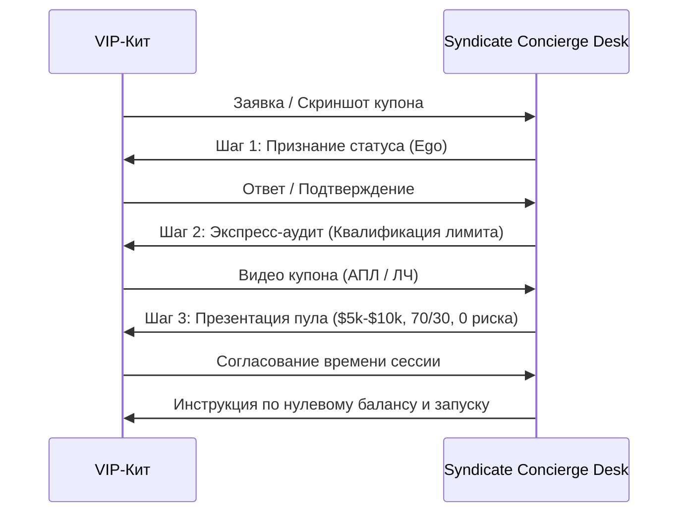

# VIP Liquidity Syndicate: Скрипт закрытия китов и операционный регламент

> **Внутренний регламент VIP Concierge Desk**  
> *Концепция: Закрытый клуб аудита лимитов и аллокации синдикатного капитала*  
> *Целевая аудитория: High-Roller игроки (Whales) с отрицательным балансом и VIP-статусом в крипто-букмекерах (Stake, Sportsbet.io, BC.Game, Roobet, Cloudbet).*

---

## 1. Фундаментальное позиционирование (Tone of Voice)

1. **Никакого сленга дроповодов**: Запрещены слова *«аренда»*, *«покупка аккаунта»*, *«прогрев»*, *«дроп»*, *«тема»*, *«схема»*.
2. **Институциональный язык**: Используются термины: *«аллокация капитала»*, *«канал ликвидности»*, *«риск-профиль»*, *«дисперсия»*, *«сплит прибыли»*, *«некастодиальный протокол»*, *«торговая сессия»*.
3. **Партнер на равных**: Кит — состоятельный человек, проигравший крупную сумму. Он зол на букмекера и подозрителен. С ним общаются с уважением к его статусу, признавая, что его аккаунт — это дефицитный финансовый актив.

---

## 2. Пошаговый скрипт ведения диалога в Telegram



---

### Шаг 1: Признание статуса и снятие первого подозрения (Эго)

> **Цель:** Показать, что мы понимаем масштаб игрока и не являемся школьниками-скамерами.

**Скрипт:**
> *«Приветствуем, [Имя / @username]! Получили вашу заявку по [Stake Platinum IV / Sportsbet Clubhouse / BC.Game SVIP].*
>
> *Отличный уровень профиля. Сейчас букмекеры включили максимально жесткие алгоритмы порезки на свежих счетах — аналитические отделы режут за 2–3 ставки. Поэтому такие зрелые, "нагретые" VIP-аккаунты с хорошей историей для нашего синдиката — приоритет №1 под аллокацию пулов ликвидности.»*

---

### Шаг 2: Первичный аудит и квалификация (Проверка лимита)

> **Цель:** Отсеять неликвидные порезанные аккаунты без прямого вопроса «а тебя уже забанили?».

**Скрипт:**
> *«Чтобы аналитический отдел согласовал точный объем выделяемого банкролла (от $10,000 до $50,000+), нам нужно зафиксировать текущий потолок ставки.*
>
> *Сделайте, пожалуйста, короткий чек в купоне:*
> 1. *Откройте ближайший топ-матч (Английская Премьер-Лига или Лига Чемпионов, исход 1X2).*
> 2. *Вбейте в купон сумму $50,000 (ставить не нужно).*
> 3. *Какую максимальную ставку (`Max Bet`) показывает система? Пришлите скриншот или короткую запись экрана.*
> 4. *И второй момент: нет ли сейчас холдов или ограничений на вывод средств?»*

---

### Шаг 3: Презентация условий и снятие страха скама (Безопасность)

> **Цель:** Закрыть возражение «вы украдете мой аккаунт/деньги» и предложить тест без обязательств.

**Скрипт:**
> *«Отлично, лимит подтвержден ($28,000 на исход). Аккаунт подходит под категорию Tier-A.*
>
> *Как мы работаем:*
> 1. **Non-Custodial:** Нам **не нужны ваши пароли**, почты или 2FA. Все учетные данные остаются исключительно у вас.
> 2. **0 личного риска:** Перед стартом вы **выводите все свои средства до нуля**. Вы не рискуете ни одним центом.
> 3. **Синдикатный банкролл:** Мы заводим собственный капитал фонда. На первый тестовый пул выделяем **$5,000 – $10,000**.
> 4. **Сплит прибыли:** Работаем по модели **70/30** (30% чистой прибыли — ваши). Если случается просадка — это 100% убыток фонда, вы ничего не компенсируете.
> 5. **Прозрачность:** Сессия проходит либо в защищенном профиле браузера, либо через TeamViewer / AnyDesk под вашим наблюдением.
>
> *Предлагаем запустить короткую тестовую сессию на 2–3 дня. Когда вам комфортно согласовать график?»*

---

## 3. Анти-Inspect Element протокол (Защита от фейков)

Киты и перекупщики иногда редактируют HTML код страницы через `F12 / Inspect Element`, чтобы завысить лимиты.

**Правила верификации риск-деска:**
1. **Скриншоты статичных картинок НЕ принимаются** как финальное подтверждение для выделения капитала свыше $10,000.
2. **Обязательный формат проверки:**
   - Короткая видеозапись с телефона/экрана: открыт купон матча, вводится сумма, **нажимается F5 (обновление страницы)** и лимит сохраняется.
   - Либо 2-минутный созвон в Telegram с демонстрацией экрана, где аналитик просит кликнуть на 2 разных матча.
3. **Проверка истории транзакций:**
   - Убедиться, что на аккаунте нет нерешенных тикетов службы безопасности (KYC Level 2/3 пройден, вывод работает штатно).

---

## 4. Обработка ключевых возражений (FAQ)

### Возражение 1: «А если вы сольете весь банкролл?»
> **Ответ:**  
> *«Все средства, которые заводятся на баланс — это 100% капитал синдиката. Ваши личные деньги на аккаунте отсутствуют (вы выводите баланс в ноль до старта). Если пул закрывается в минус по дисперсии, вы не несете никакой финансовой ответственности. Риски покрываются страховым фондом синдиката.»*

### Возражение 2: «Зачем вам мой аккаунт, если вы такие прибыльные аналитики?»
> **Ответ:**  
> *«У букмекеров есть отдел риск-менеджмента. Как только наш счет показывает серию алгоритмических плюсовых ставок, лимиты режут до $5-$10 за 24 часа. Создавать новые аккаунты бесполезно — новые счета сразу попадают под фрод-фильтры. Ваш VIP-аккаунт для букмекера выглядит как обычный игрок с солидной историей, поэтому на нем держат максимальные лимиты. Мы монетизируем эту разницу вместе.»*

### Возражение 3: «Вы можете украсть мой аккаунт или сменить почту?»
> **Ответ:**  
> *«Технически это невозможно по трем причинам:*
> 1. *Мы не берем пароль и почту.*
> 2. *Смена реквизитов на крипто-букмекерах требует подтверждения по вашей личной почте и 2FA на вашем телефоне.*
> 3. *Вы можете наблюдать за экраном во время сессии через AnyDesk. Нам нужны только кнопки совершения ставки в купоне.»*

### Возражение 4: «Как происходят выплаты?»
> **Ответ:**  
> *«Расчетный цикл составляет от 3 до 7 дней в зависимости от плотности матчей. Профит фиксируется, средства выводятся на ваш кошелек или согласованный адрес, и вы переводите долю фонда за вычетом ваших 30–40% в USDT (TRC20/ERC20).»*

---

## 5. Webhook Payload: Интеграция с Telegram-ботом команды

При отправке формы с сайта на бэкенд формируется сообщение следующего формата для закрытого канала аналитиков:

```text
🚨 НОВАЯ ЗАЯВКА НА АУДИТ VIP-ЛИКВИДНОСТИ

🏛 Букмекер: Stake (Platinum IV – Diamond)
📉 Исторический минус: $50,000+
📊 Оценочный лимит: $25,000
💼 Расчетный банкролл фонда: $50,000 USDT
💰 Прогнозируемый сплит: 35% ($1,850 - $3,600/мес)

👤 Telegram: @username_whale
📎 Файл купона: [Прикреплен / media_id_7482]
⏱ Время заявки: 2026-09-19 01:45:00 UTC

Статус: 🟡 ОЖИДАЕТ СВЯЗИ КОНСЬЕРЖА
```
