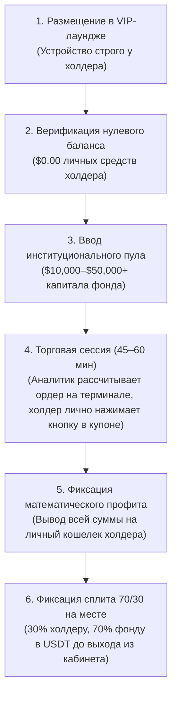

# 🏛 VIP LIQUIDITY SYNDICATE // PRIVATE WEALTH PROTOCOL
### Haute Horlogerie & Institutional Concierge Desk Playbook
`SERIAL NO: VHS-2026-CH-0919` • `CLASSIFICATION: PRIVÉ & STRICTEMENT CONFIDENTIEL` • `REGISTRY: SWISS QUANT CAPITAL`

> ***«Вы никогда не передаете контроль над своим устройством. Вы лишь открываете институциональный коридор ликвидности для следующей сессии.»***  
> — *Адаптированный императив Haute Horlogerie (Patek Philippe & Audemars Piguet Private Desk Standard)*

---

## 0. Устав элитной типографики и верстки синдиката (Editorial & Typography Charter)

Вся визуальная и текстовая продукция VIP Liquidity Syndicate (веб-интерфейсы, сценарии консьержа, инвестиционные меморандумы, тикеты в Telegram) подчиняется стандартам швейцарских часовых мануфактур (Patek Philippe, Audemars Piguet, Vacheron Constantin) и частного банковского обслуживания (Goldman Sachs Private Wealth Management, Pictet & Cie, Lombard Odier).

### 0.1. Иерархия шрифтовых гарнитур (The 5 Sovereign Typefaces)

```
┌──────────────────────────────────────────────────────────────────────────────────────────────────┐
│  ГАРНИТУРА           НАЗНАЧЕНИЕ В ИНТЕРФЕЙСАХ И ДОКУМЕНТАХ              ПАРАМЕТРЫ ТИПОГРАФИКИ   │
├──────────────────────────────────────────────────────────────────────────────────────────────────┤
│  Cinzel              Римские императорские маюскулы, капитель,          Uppercase,               │
│                      маркеры глав, бейджи, кнопки, тикеры, HUD.         Tracking: +0.20em..+0.28em│
│                                                                                                  │
│  Cormorant Garamond  Высокая редакционная антиква с полной              Light 300 / Regular 400, │
│                      кириллицей, титульные полосы, роскошные курсивы.   Tracking: -0.038em..-0.04em│
│                                                                         Leading: 0.92..0.96      │
│                                                                                                  │
│  Playfair / Prata    Акцентные редакционные курсивы для ключевых        Italic 400,              │
│                      философских метафор и слоганов синдиката.          Luminescence Foil        │
│                                                                                                  │
│  Manrope             Швейцарский чистейший неогротеск для чтения        Light 300 / Medium 500,  │
│                      лонгридов, карточек аргументации, соглашений NDA.  Leading: 1.65..1.70      │
│                                                                                                  │
│  JetBrains Mono      Табулярные финансовые цифры (tnum 1), временные    Tabular Lining Nums,     │
│                      метки, ончейн-хэши, телеметрия сессий, PnL-сплит.  Tracking: +0.14em..+0.22em│
└──────────────────────────────────────────────────────────────────────────────────────────────────┘
```

### 0.2. Матрица OpenType Feature-Settings
В CSS и верстке веб-страниц обязательно активируется полный спектр типографических возможностей шрифтового движка:
```css
font-feature-settings: 
  "liga" 1,   /* Общие контекстные лигатуры */
  "dlig" 1,   /* Дискреционные исторические лигатуры антиквы (ct, st) */
  "kern" 1,   /* Оптическое попарное кернение */
  "cv01" 1,   /* Альтернативные глифы с изысканными росчерками (swashes) */
  "cv02" 1,   /* Варианты начертания маюскулов */
  "ss01" 1,   /* Стилистический сет высокой антиквы */
  "tnum" 1;   /* Табулярные цифры одинаковой ширины для финансовых колонок */
```

### 0.3. Регламент микрокернинга и трекинга
- **Крупные титульные заголовки (Display & H1):** Отрицательный благородный трекинг `tracking-[-0.038em]` ... `tracking-[-0.04em]` в сочетании с экстремально плотным интерлиньяжем `leading-[0.92]` ... `leading-[0.96]`. Исключает «рыхлость» и придает слову монолитную весомость литого слитка.
- **Маркеры статуса, римские цифры, бейджи, кнопки, HUD:** Открытый благородный трекинг `tracking-[0.20em]` ... `tracking-[0.28em]`. Только `text-transform: uppercase` и шрифт Cinzel либо JetBrains Mono.
- **Длинный текст объяснений (Manrope):** Свободный естественный трекинг `tracking-[-0.01em]` ... `tracking-[0]`, интерлиньяж `leading-[1.65]`.

### 0.4. Металлические градиентные заливки с мягким свечением
- `.gold-foil-text`: 24-каратное банковское золото `linear-gradient(135deg, #FFFDF5 0%, #FBE8C5 18%, #D4AF37 42%, #9E7728 72%, #FBF0D9 100%)` с мягкой люминесцентной тенью `drop-shadow(0 2px 22px rgba(212, 175, 55, 0.38))`.
- `.platinum-foil-text`: Чистая матированная платина `linear-gradient(135deg, #FFFFFF 0%, #EFF4F9 24%, #BAC7D5 55%, #7D8E9F 82%, #EBF1F7 100%)` со свечением `drop-shadow(0 2px 20px rgba(186, 199, 213, 0.32))`.
- `.emerald-foil-text`: Суверенный швейцарский изумруд `linear-gradient(135deg, #F0FDF4 0%, #6EE7B7 26%, #10B981 56%, #047857 85%, #A7F3D0 100%)` со свечением `drop-shadow(0 2px 22px rgba(16, 185, 129, 0.40))`.

### 0.5. Культура орфографии и финансовых чисел в коммуникации
1. **Кавычки:** Исключительно французские/русские кавычки-«елочки» («...»), для внутренних цитат — „лапки“. Двойные машинописные кавычки ("...") в тексте переписки строго запрещены.
2. **Тире:** Различаются дефис (-), короткое тире (en-dash: 10–50 тыс.) и длинное тире (em-dash: —) с неразрывными пробелами.
3. **Финансовые суммы:** Пишутся строго с разделителями тысяч и неразрывными пробелами: `$50,000 USDT` или `50 000 USDT`. Никогда не писать «50к», «полтос», «банки».

---

## 1. Фундаментальный манифест институционального языка (Tone of Voice)

В коммуникации с VIP-холдерами категорически запрещено использовать лексику уличного беттинга, форумов перекупщиков и арбитражного скама. Синдикат позиционируется исключительно как **институциональный количественный фонд (Proprietary Trading Desk)**, работающий на стыке спортивного квант-моделирования и аллокации частного капитала.

### Матрица терминологической конверсии (Глоссарий очищения)

| ❌ Запрещенный сленг розницы / дроповодов | ✅ Утвержденный институциональный стандарт |
| :--- | :--- |
| *«Дроп», «дроповод»* | **«Авторизованный холдер VIP-профиля», «Стратегический партнер синдиката»** |
| *«Порезка», «порезанный аккаунт»* | **«Лимитная компрессия», «Динамические риск-фильтры букмекера»** |
| *«Открутка», «прокрут», «прогон»* | **«Синдикатная аллокация ликвидности», «Алгоритмическая торговая сессия»** |
| *«Бан», «забанили»* | **«Регуляторный комплаенс-холд», «Профиль с ограниченной ликвидностью»** |
| *«Прогрев», «нагретый аккаунт»* | **«Зрелый профиль с подтвержденной отрицательной дисперсией (Tier-A)»** |
| *«Заливка баланса»* | **«Депонирование синдикатного капитала», «Ввод институционального пула»** |
| *«Слив банкролла»* | **«Плановая математическая просадка фонда», «Рыночная дисперсия»** |
| *«Тема», «схема», «связка»* | **«Алгоритмический арбитраж неэффективностей», «Протокол аллокации»** |
| *«Взять телефон в руки», «AnyDesk»* | **«Некастодиальный протокол физического присутствия (Телефон за 60 минут ни разу не касается чужих рук)»** |
| *«Скинуть процент потом»* | **«Фиксация сплита прибыли 70/30 на месте (в USDT до выхода из VIP-лаунджа)»** |

### Психологический портрет кита (Whale Persona)
1. **Высокий социальный и финансовый статус:** Кит проиграл от $50,000 до $500,000+. Для него потеря денег неприятна, но потеря конфиденциальности, репутации или компрометация смартфона — катастрофична.
2. **Паранойя безопасности:** Он знает про трояны, фишинг и утечки криптокошельков. При малейшей попытке «взять телефон в руки» или «поставить AnyDesk» диалог немедленно обрывается.
3. **Гнев на букмекера:** Он считает правила букмекера несправедливыми. Возможность монетизировать свой проигрыш и забрать капитал у конторы за счет чужих денег — сильнейший психологический триггер.
4. **Партнерство на равных:** Консьерж общается не с позиции просителя, а с позиции управляющего фондом с 8-значным AUM, признавая уникальную ценность пропускной способности аккаунта холдера.

---

## 2. Некастодиальный протокол физического присутствия (Non-Custodial Physical Presence)

> **Ключевой стандарт синдиката:**  
> **«Ваш телефон за 60 минут сессии ни разу не касается чужих рук.»**

Сессии проводятся в премиальных переговорных офисах и закрытых клубах (Москва-Сити, Dubai DIFC / Downtown, Лимассол, Сингапур).



### Железные правила аппаратной неприкосновенности:
1. **Zero Physical Contact:** Аналитик или консьерж физически не имеют права прикасаться к экрану, корпусу или чехлу телефона холдера.
2. **Терминал аналитика:** Аналитик работает за закрытым ноутбуком/планшетом со своей quant-моделью, отслеживающей котировки топовых азиатских и европейских бирж ликвидности.
3. **Личный клик холдера:** Аналитик озвучивает параметр: *«Матч Арсенал — Ливерпуль, исход П1, объем $15,000 по коэффициенту 1.92»*. Холдер лично находит событие в приложении, вводит сумму и лично нажимает кнопку «Разместить ордер».
4. **Zero Remote Access:** Никаких AnyDesk, TeamViewer, сторонних профилей или MDM-сертификатов. Никаких следов в системе устройства.
5. **Zero Passwords:** Логины, пароли, почта, 2FA и seed-фразы остаются исключительно на устройстве холдера.

---

## 3. Сценарий очных переговоров в VIP-лаундже (Executive Face-to-Face Pitch)

### Фаза 1: Установление паритета и валидация эго (Status Alignment)
*Локация: Закрытая переговорная, панорамный вид, премиальный кофе/чай. На столах — только планшет аналитика с графиками ликвидности.*

**Консьерж:**
> *«Добрый день, [Имя]. Рады приветствовать вас в нашем закрытом деске. 
> 
> Сразу определим статус нашей встречи: мы пригласили вас не как клиента на платную услугу, а как равноправного партнера под выделение институционального пула капитала. 
> 
> Наш синдикат специализируется на количественном арбитраже спортивных маркетов. У нас есть работающие математические модели и капитал фонда, но у букмекеров есть отделы риск-профайлинга: как только чистый аналитический счет делает серию плюсовых сделок, они включают лимитную компрессию до $5 за ордер.
> 
> При этом ваш профиль [Stake Platinum IV / Sportsbet Clubhouse] с исторической отрицательной дисперсией обладает редким качеством — гигантской пропускной способностью на топ-маркеты. Для нас ваш аккаунт — это дефицитный шлюз ликвидности. Мы готовы направить в него собственный оборотный пул, полностью закрыв финансовые риски со стороны фонда.»*

---

### Фаза 2: Презентация протокола сделки (The 5 Institutional Pillars)

**Консьерж:**
> *«Мы разработали регламент, полностью исключающий риски для состоятельных людей. Вот 5 нерушимых правил сегодняшней сессии:
> 
> 1. **Некастодиальный протокол:** Ваш телефон за все время сессии ни разу не коснется чужих рук. Вы держите устройство перед собой. Никаких AnyDesk, проводов или установки софта.
> 2. **0% персонального финансового риска:** Перед началом вы лично убеждаетесь, что на балансе аккаунта ровно $0.00 ваших средств. Вы не рискуете ни одним личным центом.
> 3. **Институциональный пул $10,000–$50,000+:** Мы заводим 100% собственный капитал синдиката на баланс. Если на сессии возникает рыночная просадка — это 100% убыток фонда, покрываемый нашим страховым резервом. Вы ничего не должны.
> 4. **Вы управляете кнопкой:** Наш аналитик рассчитывает неэффективность в котировках на своем терминале и называет вам параметры. Вы лично вбиваете сумму и лично нажимаете кнопку подтверждения.
> 5. **Фиксация сплита прибыли 70/30 на месте:** Сессия длится ровно 45–60 минут. После закрытия торгового пула мы заказываем вывод на ваш личный криптокошелек. 30% чистой прибыли остаются у вас, 70% переводится в пул фонда прямо здесь за столом, до того как вы выйдете из лаунджа.»*

---

### Фаза 3: Демонстрационный расчет на экране планшета

Консьерж поворачивает планшет с открытым симулятором доходности:
> *«При подтвержденном разовом лимите в $25,000 на исход матча АПЛ синдикат открывает пул на сессию в размере $62,500. 
> При средней сессионной доходности 8–12% чистая прибыль пула составляет порядка $5,000 – $7,500 USDT. 
> Ваша доля 30% за одну встречу — это $1,500 – $2,250 USDT чистыми. 
> При графике 2 сессии в неделю это $12,000 – $18,000 USDT в месяц пассивных дивидендов без единого цента личных вложений.»*

---

## 4. Отработка ключевых институциональных возражений китов

### Возражение 1: «Это не грязная крипта? Не отмывание средств через мой профиль?»
> **Институциональный ответ:**  
> *«Исключено на 100%. Наш синдикат работает исключительно с институциональными провайдерами ликвидности и лицензированными внебиржевыми OTC-десками. 
> 
> Все средства депонируются в чистом, верифицированном USDT (TRC20/ERC20) с AML-скорингом риска транзакций 0% (Clean Institutional Tier-1). Перед тем как отправить транзакцию на пополнение баланса в вашей БК, мы предоставляем ончейн-хэш транзакции и отчет Chainalysis / AMLBot. 
> 
> У букмекера никогда не возникнет вопросов к происхождению средств, потому что они приходят с чистых резервных кошельков фонда.»*

---

### Возражение 2: «Если вы такие прибыльные, почему не ставите сами со своих аккаунтов?»
> **Институциональный ответ:**  
> *«Потому что рынок букмекеров устроен по принципу динамического риск-профайлинга, а не открытой биржи. 
> 
> Как только наш математический отдел регистрирует новый корпоративный профиль и делает серию плюсовых сделок с перевесом над линией, антифрод-система букмекера моментально активирует лимитную компрессию: максимальную ставку урезают с $50,000 до $10. Букмекеру не выгодны профессионалы.
> 
> Букмекер зарабатывает на игроках с отрицательным математическим ожиданием. Ваш аккаунт для их системы — образцовый VIP-клиент категории Tier-A, которому система сама держит открытый зеленый коридор и максимальную глубину лимитов. Мы соединяем наши алгоритмы и ваш открытый канал ликвидности в формате Win-Win.»*

---

### Возражение 3: «А если рынок развернется и весь баланс сессии уйдет в минус?»
> **Институциональный ответ:**  
> *«В спортивном квант-трейдинге существует понятие рыночной дисперсии. Даже при подтвержденном положительном математическом ожидании отдельная торговая сессия может закрыться в просадке. 
> 
> Но вся ключевая архитектура нашего предложения строится вокруг правила: **0% персонального финансового риска для холдера**. 
> 
> 100% заведенного банкролла — это средства нашего фонда. Вы предварительно выводите свои деньги в ноль. Если сессия закрывается в минус, фонд полностью списывает этот убыток за счет собственного страхового резерва. Вы не несете никакой материальной ответственности, ничего не возмещаете и просто ждете следующего согласованного торгового окна.»*

---

### Возражение 4: «Вы можете получить доступ к моим личным данным, перепискам или кошелькам на телефоне?»
> **Институциональный ответ:**  
> *«Именно поэтому мы категорически отказались от любых удаленных утилит вроде AnyDesk и перешли на некастодиальный протокол физического присутствия. 
> 
> Ваш телефон за 60 минут сессии ни разу не касается чужих рук. Вы сидите в удобном кресле, устройство находится у вас перед глазами. Мы не просим вас устанавливать никакие профили, сертификаты или приложения. 
> 
> Вы открываете официальное приложение вашей БК сами, своими пальцами. Нам нужны только цифры маркета, которые мы выводим на наш монитор. Никакого физического или программного доступа к вашему устройству не существует в природе.»*

---

### Возражение 5: «Букмекер не заблокирует мой аккаунт и мой VIP-статус?»
> **Институциональный ответ:**  
> *«Антифрод-алгоритмы букмекеров триггерятся на три вещи: смену устройства/IP, ставки на низколиквидную "грязь" (смоллмаркеты, настольный теннис, третьи лиги) и подозрительные скачки сумм. 
> 
> Наш протокол исключает все три фактора:
> 1. Сессия проходит с вашего привычного устройства и вашего мобильного интернета.
> 2. Мы работаем исключительно на Tier-1 рынках: Английская Премьер-Лига, Лига Чемпионов, NBA, топовые турниры Большого Шлема. На таких рынках оборот измеряется сотнями миллионов долларов, и наши ордера по $10,000–$25,000 являются естественной органической каплей в общем стакане.
> 3. Букмекер видит естественное продолжение поведения VIP-игрока. Ваш статус, кэшбеки и привилегии персонального VIP-менеджера остаются нетронутыми.»*

---

### Возражение 6: «Откуда уверенность, что я получу свои 30% прибыли?»
> **Институциональный ответ:**  
> *«Заметьте: в нашей модели не вы отдаете деньги нам, а мы заводим свои $10,000–$50,000+ на ваш верифицированный аккаунт. 
> 
> После успешного закрытия сессии баланс находится внутри вашего профиля. Вы лично оформляете заявку на вывод на свой собственный криптокошелек. 
> 
> Деньги приходят вам. Вы забираете свои 30% чистой прибыли, а долю фонда (70% плюс тело пула) переводите обратно в пул синдиката прямо здесь, в нашем присутствии. Фиксация сплита прибыли 70/30 происходит на месте за столом.»*

---

## 5. Пошаговый скрипт ведения диалога в Telegram VIP Desk

### Шаг 1: Признание статуса (Ego & Asset Valuation)
> **Консьерж:**  
> *«Приветствуем, [Имя / @username]! Получили вашу заявку по профилю [Stake Platinum IV / Sportsbet Clubhouse / BC.Game SVIP].*
> 
> *Отличный профиль. На рынке сейчас единицы аккаунтов с такой зрелой историей и открытыми коридорами ликвидности. Букмекеры активировали максимально жесткие динамические риск-фильтры на свежих счетах, поэтому для нашего институционального синдиката зрелые VIP-профили вашего уровня — приоритет №1 под прямую аллокацию пулов капитала.*
> 
> *Готовы рассмотреть выделение институционального пула $10,000–$50,000+ под совместную торговую сессию.»*

---

### Шаг 2: Экспресс-аудит глубины лимита (Market Depth Check)
> **Консьерж:**  
> *«Чтобы аналитический совет деска утвердил точный объем выделяемого капитала фонда ($10,000, $25,000 или $50,000+), нам необходимо зафиксировать текущую пропускную способность купона.*
> 
> *Сделайте, пожалуйста, 30-секундный чек в приложении:*
> 1. *Откройте ближайший топ-матч (АПЛ или Лига Чемпионов, основной исход 1X2).*
> 2. *Вбейте в купон сумму $50,000 (размещать ордер не нужно).*
> 3. *Какую предельную сумму (`Max Bet`) отображает система? Пришлите, пожалуйста, короткое видео экрана.*
> 4. *И подтвердите: баланс чист от вейджеров, вывод функционирует штатно?»*

---

### Шаг 3: Презентация институциональных условий
> **Консьерж:**  
> *«Лимит подтвержден: $28,500 на исход. Профиль квалифицирован по наивысшей категории Tier-A.*
> 
> *Базовые условия институционального соглашения:*
> - **Некастодиальный протокол физического присутствия:** Ваш телефон за 60 минут ни разу не касается чужих рук. Пароли, 2FA и почта остаются у вас.
> - **0% персонального финансового риска для холдера:** До старта вы выводите абсолютно весь свой баланс до $0.00.
> - **Институциональный пул $10,000–$50,000+:** Капитал на 100% заводится фондом. Все просадки и рыночная дисперсия — это 100% ответственность синдиката.
> - **Фиксация сплита прибыли 70/30 на месте:** 30% чистой прибыли фиксируется за вами и выплачивается в USDT сразу после закрытия сессии.
> 
> *Предлагаем провести первую очную сессию в нашем закрытом лаундже в [Москва-Сити / Dubai DIFC]. В какой день вам комфортно запланировать встречу?»*

---

## 6. Протокол верификации риск-деска (Anti-Inspect & Live Proof Verification)

Киты и неквалифицированные лица могут имитировать лимиты через `Inspect Element / F12` в веб-браузерах. Риск-деск синдиката обязан соблюдать протокол жесткой верификации:

1. **Запрет статичных скриншотов:** Скриншоты в формате `.jpg / .png` принимаются только для предварительной заявки, но не дают права на выделение капитала свыше $10,000.
2. **Динамический аудит (Live Refresh Protocol):**
   - Обязательна непрерывная видеозапись экрана (с телефона на телефон либо запись экрана iOS/Android).
   - На видео пользователь открывает купон, вводит сумму $50,000, затем **выполняет свайп вниз для обновления страницы (pull-to-refresh) либо нажимает F5**, и лимит сохраняется.
   - Пользователь переходит между 2 разными матчами топ-лиги (например, Манчестер Сити vs Реал Мадрид), демонстрируя консистентность лимита.
3. **Комплаенс-чекер статуса профиля:**
   - Верификация KYC Level 2/3 (Identity + Proof of Address).
   - Проверка отсутствия открытых тикетов со службой поддержки и скрытых холдов на вывод криптоактивов.

---

## 7. Операционный регламент дня сессии (Day-of-Session Protocol)

### Pre-Session Checklist (За 60 минут до встречи)
- [ ] Холдер подтвердил нулевой баланс на счете ($0.00) скриншотом.
- [ ] Риск-деск синдиката зарезервировал пул ликвидности ($10,000 – $50,000 USDT) на горячем кошельке деска.
- [ ] Подготовлена закрытая переговорная в VIP-лаундже (DIFC Dubai / Москва-Сити).
- [ ] AML-скоринг транзакции синдиката проверен (Risk Score < 0.5%).

### In-Session Protocol (45–60 минут сессии)
- [ ] Холдер размещается в кресле напротив аналитика. Смартфон находится исключительно перед холдером.
- [ ] Аналитик открывает терминал и рассчитывает ордерную сетку на топ-события.
- [ ] Депонирование институционального пула на баланс профиля холдера с корпоративного кошелька фонда.
- [ ] Холдер лично размещает ордера по указанию аналитика (1–3 крупных ордера на топовые ликвидные рынки).
- [ ] Ожидание расчета событий / кэшаут при достижении целевого математического ожидания.

### Post-Session Settlement (Фиксация прибыли на месте)
- [ ] Фиксация итогового сессионного PnL.
- [ ] Холдер лично создает заявку на вывод полной суммы на свой личный некастодиальный кошелек.
- [ ] Поступление средств на кошелек холдера.
- [ ] Моментальный взаиморасчет: холдер удерживает 30% чистой прибыли, возвращая тело пула и 70% фонда на адрес деска.
- [ ] Фиксация слота в календаре на следующую торговую сессию.

---

## 8. Webhook & CRM Data Schema для закрытого Telegram-деска

При отправке формы с посадочной страницы на бэкенд формируется институциональный отчет следующего формата:

```text
🏛 НОВАЯ ЗАЯВКА НА АУДИТ ИНСТИТУЦИОНАЛЬНОЙ ЛИКВИДНОСТИ

📋 СТАТУС ПРОФИЛЯ:
• Крипто-букмекер: Stake (Tier 1 Liquidity • Platinum IV – Diamond)
• Историческая дисперсия: -$75,000+ USD
• Подтвержденный лимит в купоне: $32,000 USD (EPL 1X2)
• Комплаенс: KYC L3 Completed • 0 активных холдов

💼 АЛЛОКАЦИЯ КАПИТАЛА СИНДИКАТА:
• Институциональный пул: $50,000 USDT
• Формат сессии: Некастодиальный протокол физического присутствия (VIP Lounge Dubai DIFC)
• Финансовый риск холдера: 0% персонального риска (депозит фонда)
• Прогнозируемый сплит прибыли: 30% холдеру (~$1,800 - $3,500 USDT / сессия)

👤 КОНТАКТ ХОЛДЕРА:
• Telegram: @username_whale
• ID Тикета: SYND-8842
• Временная метка: 2026-09-19 02:15:00 UTC

Статус: 🟡 ОЖИДАЕТ ЗАКРЕПЛЕНИЯ ПЕРСОНАЛЬНОГО КОНСЬЕРЖА
```
